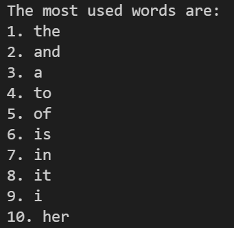
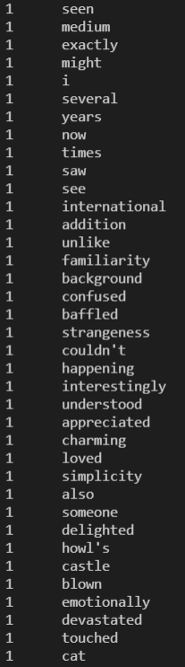

# PROJECT REPORT: TEXT MINING IMDB REVIEWS

### Project Overview
This project utilizes data from IMDb user reviews, based on the movie *Spirited Away* by *Hayao Miyazaki*. This project will be divided into two parts based on text-frequency analysis methodology, the first using conventianal counters and the second through in-depth analysis with TF-IDF methodology, which considers both word frequency and word significance. The point of TF-IDF is to ensure that common words that provide no significance (e.g. "the", "a") to the textual analysis are ignored. The output provides a list of the most frequently used words, and their occurrences among all reviews. The project aims to use text-mining analysis to better understand the characteristics and features of different reviewers of *Spirited Away*.

### Implementation
Several methods could be used when analyzing multiple movie reviews. There were 2 optimal designs for this particular project, which were text-frequency analysis with TF-IDF or sentiment-analysis with natural language processing (NLP). Sentiment-analysis would have been a very good-fit for the purposes of this project, considering the fact that many user reviews are directly influced by personal factors such as opinion and emotion. However, text-frequency analysis had more flexibilty with anlsys/output and is also less prone to errors that may occur during natural language processing. Therefore, text-frequcy and TF-IDF are selected as the primary design.

The first part of this project uses conventianl text frequncy methods, which converts the raw data into a useable list for the program. Wrods our counted using loops into a dictionary, of which would later be sorted and return a list of the most frequently used words among all reviews. The second part of this project does the same conventianal text frequency methods, but with the support of TF-IDF. Ther first aspect of TF-IDF is the **text frequency** measure, which dtermines the frequency of a word local to its source (e.g. user reviews). The second aspect is the **inverse document frequency** measure, which is a constant that is claculated based on the frequecny of the same word throught the corpus (collection of texts). The product of these two calculation will give a decimal rating that determines both the frequncy and singificance of the word.

The structure of the code uses functions that splits apart all components of the overall architecture, and a final code would bring together all these components along with an output in the form of a list/table for easy viewing. A few exmaples of major components include data processing, counters(normal and unqiue) and tf-idf algorithms. The majoirty of the code also operates using different variation of for loops, dictionary, and lists on big textual data.

### Results
From the first part of the project, the results were more or less to be exptected. The top 10 words that are used among the reviews can be seen in the exhbit below. As we can see from the results, none of the ouput can provide good constructive understanding of the text, and no further anlsysis would be effective. However, the 10th most frequent word "her" does appear in the top 10 even among more common words, which seems to suggest that most users' reviews are very centric towards the female main character as opposed to other factors such as setting and plot.

The second part is far more interesting, since the TF-IDF lgorithms reveal the more meangiful words that are hidden among the common wrods from part one. 

 

### Reflection
Overall, this project has much room for improvemnt and should be viewed only as an intial attempt of textual analysis on movie reviews. 

