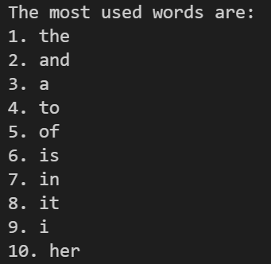
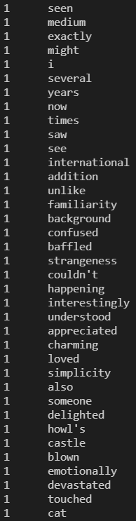

# PROJECT REPORT: TEXT MINING IMDB REVIEWS

### Project Overview
This project utilizes data from IMDb user reviews, based on the movie *Spirited Away* by *Hayao Miyazaki*. This project will be divided into two parts based on text-frequency analysis methodology, the first using conventional counters and the second through in-depth analysis with TF-IDF methodology, which considers both word frequency and word significance. The point of TF-IDF is to ensure that common words that provide no significance (e.g. "the", "a") to the textual analysis are ignored. The output provides a list of the most frequently used words, and their occurrences among all reviews. The project aims to use text-mining analysis to better understand the characteristics and features of different reviewers of *Spirited Away*.

### Implementation
Several methods could be used when analyzing multiple movie reviews. There were 2 optimal designs for this particular project, which were text-frequency analysis with TF-IDF or sentiment-analysis with natural language processing (NLP). Sentiment analysis would have been a very good fit for this project because many user reviews are directly influenced by personal factors such as opinion and emotion. However, text-frequency analysis had more flexibility with analysis/output and is also less prone to errors that may occur during natural language processing. Therefore, text-frequency and TF-IDF are selected as the primary design.

The first part of this project uses conventional text frequency methods, which convert the raw data into a useable list for the program. Words are counted using loops into a dictionary, which would later be sorted and return a list of the most frequently used words among all reviews. The second part of this project does the same conventional text frequency methods, but with the support of TF-IDF. The first aspect of TF-IDF is the **text frequency** measure, which determines the frequency of a word local to its source (e.g. user reviews). The second aspect is the **inverse document frequency** measure, which is a constant that is calculated based on the frequency of the same word throughout the corpus (collection of texts). The product of these two calculations will give a decimal rating that determines both the frequency and significance of the word.

The structure of the code uses functions that split apart all components of the overall architecture, and a final code would bring together all these components along with an output in the form of a list/table for easy viewing. A few examples of major components include data processing, counters(normal and unique), and TF-IDF algorithms. The majority of the code also operates using a different variation of loops, dictionaries, and lists on big textual data.

### Results
From the first part of the project, the results were more or less to be expected. The top 10 words that are used among the reviews can be seen in the exhibit below. As we can see from the results, none of the output can provide a good constructive understanding of the text as they are general/common words, and no further analysis would be effective. However, the 10th most frequent word "her" does appear in the top 10 even among more common words, which seems to suggest that most users' reviews are very centric towards the female main character as opposed to other factors such as setting and plot.

The second part is far more interesting since the TF-IDF algorithms reveal the more meaningful words that are hidden among the common words from part one. From the exhibits below the first few results (e.g. kids, Chihiro, parents) further reinforces that the fact that the MC remains is the main focus of most reviews. There were also a few mentions regarding anime as a genre itself (e.g. movie, good, many, much, anime), suggesting that plenty of these reviewers do not frequently encounter anime movies. Another conclusion from this analysis suggests that all users are extremely unique with their use of words, as many words are not common among other entries yet they are the most frequent/important words in their respective reviews. There is a large variety of words, and the two exhibits below are unable to display all the words available from the list. This explains why there are multiple words that only appear once in the analysis.

 

### Reflection
Overall, this project has much room for improvement and should be viewed only as an initial attempt of textual analysis on movie reviews. First, of all, the data used for this project only contains 25 reviews, so perhaps with a larger dataset, there would be more constructive conclusions from the analysis. Furthermore, there are areas to explore, such as word similarities and other forms of comparative analysis. The scope of the project could have been much wider, as TF-IDF analysis gave way for much more opportunities at first glance. I hope that next time I can improve my understanding of the code and its difficulty so that I can properly plan and manage the extent of future projects much better.

